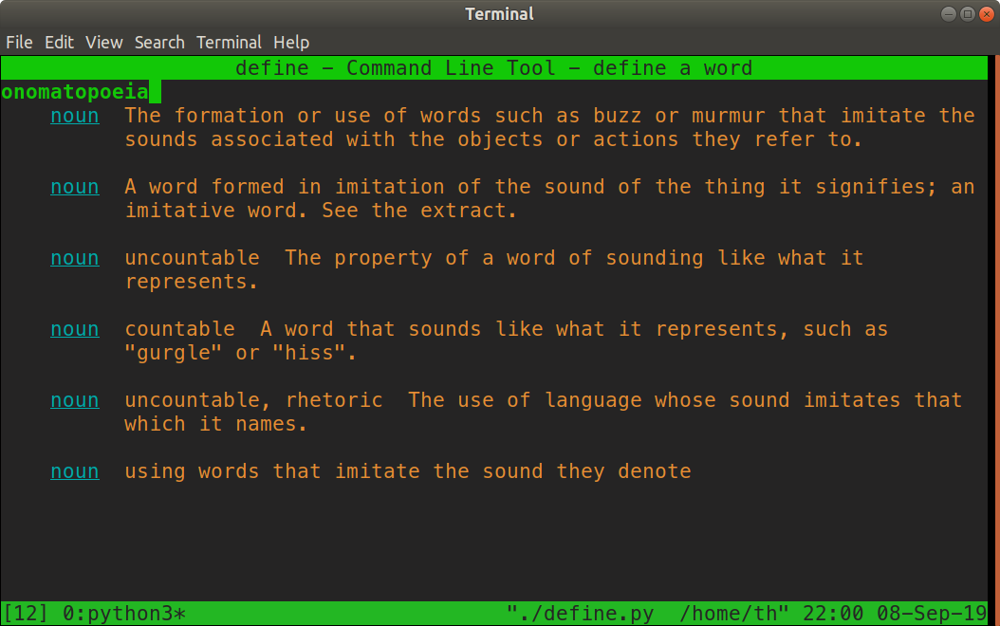

# WordnikCLI
A program for getting simple definitions for English words on the command line

This program uses BeautifulSoup, the Wordnik API (currently does scraping, but API use will be used in the future), requests (for python) to give
simple definitions for English words on the command line.

Currently a work and in progress more to come (I think)

Here are some examples of what it looks like

`./define.py think`

Another example:

`./define.py onomatopoeia`

Another example again:

`./define.py goal`

